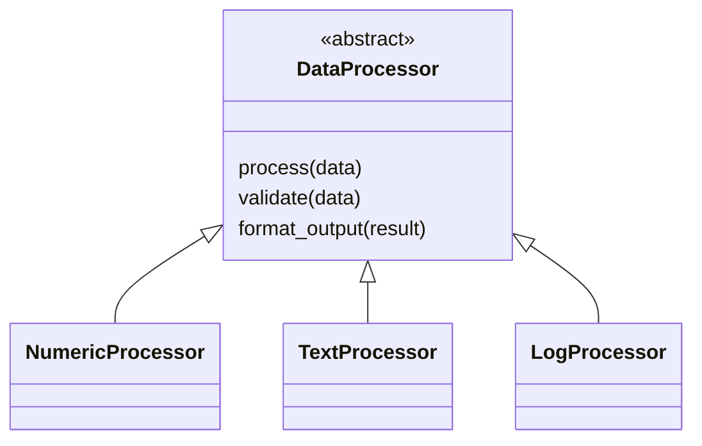
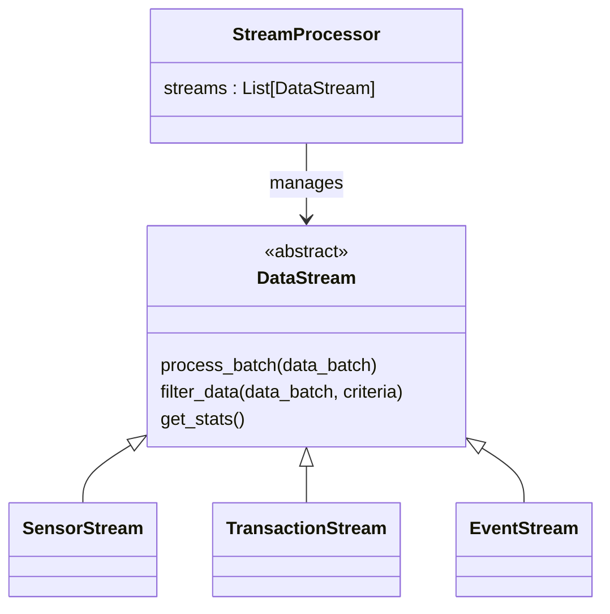
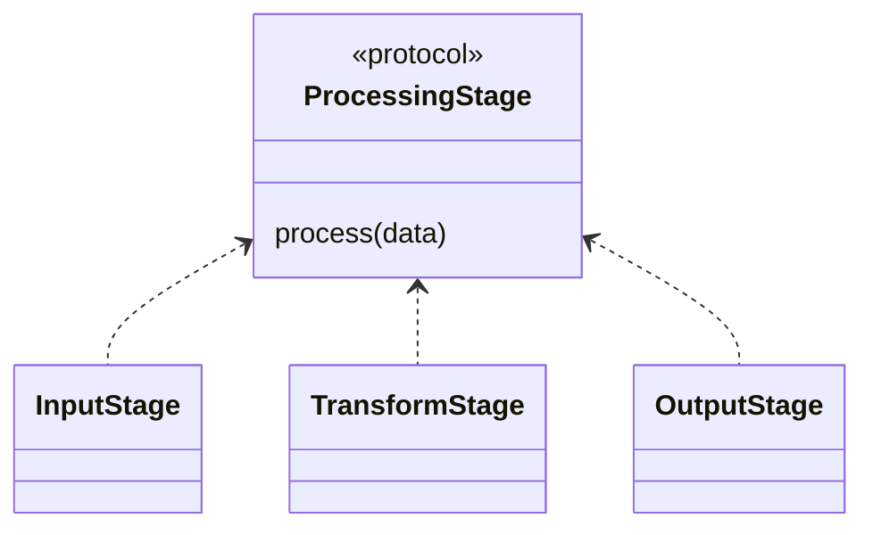
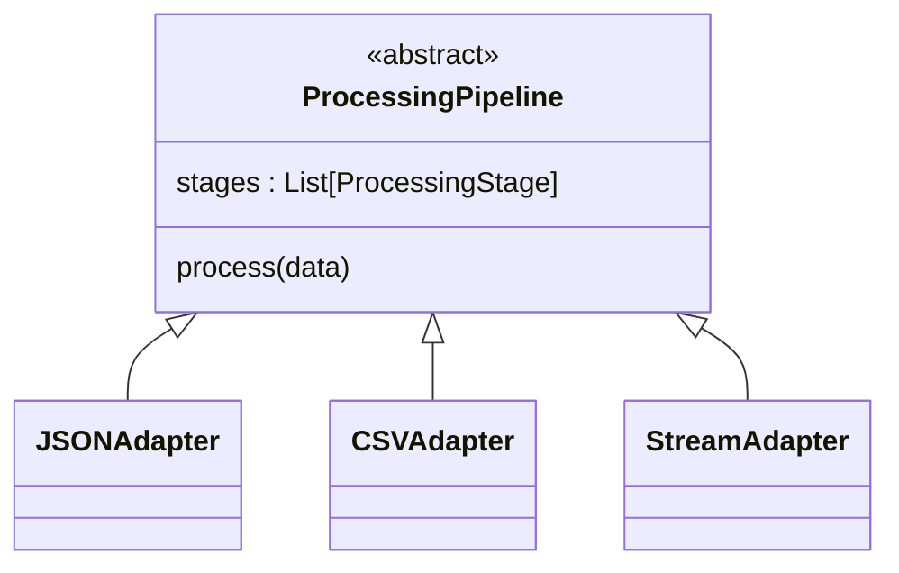
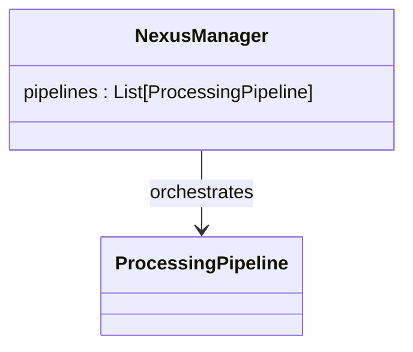

> Think **boxes and arrows**, not syntax.  
> Arrows = **IS-A** (inheritance)  
> Containment = **HAS-A** (composition)

---

## 🔹 Exercise 0 — Data Processor Foundation

### Mental Model

- **DataProcessor** defines the rules (the contract)
    
- Subclasses define **behavior**
    
- Same method call → different runtime behavior
    

### Remember

- Abstract class = _promise_
    
- Subclasses = _how the promise is fulfilled_
    

---

## 🔹 Exercise 1 — Polymorphic Streams

### Mental Model

- Streams **ARE** DataStreams
    
- StreamProcessor **HAS** streams
    
- Manager does not care _which_ stream it handles
    

### Key Insight

If you need `if stream_type == ...` → polymorphism is broken.

---

## 🔹 Exercise 2 — Nexus Integration (Big One)

### 🧩 Processing Stages (Duck Typing)

### Mental Model

- No inheritance
    
- Only behavior matters
    
- “If it has `process()`, it’s a stage”
    

---

### 🏗️ Processing Pipelines (Inheritance)

### Mental Model

- Pipelines **ARE** ProcessingPipelines
    
- Adapters override behavior
    
- Stages are _plugged in_, not inherited
    

---

### 🎛️ Nexus Manager (Orchestration)

### Mental Model

- Manager coordinates
    
- Pipelines execute
    
- Stages transform
    

---

## 🏆 Golden Rules

- **Stages are plugged in** (composition, duck typing)
    
- **Pipelines are extended** (inheritance, overriding)
    
- **Manager orchestrates** (pure polymorphism)
    
- Same interface → different behavior
    
- No type checks in managers
    

---

## 🧠 One-Sentence Summary

> _Data flows through stages, stages live inside pipelines, pipelines are specialized by adapters, and the manager runs everything without knowing concrete types._